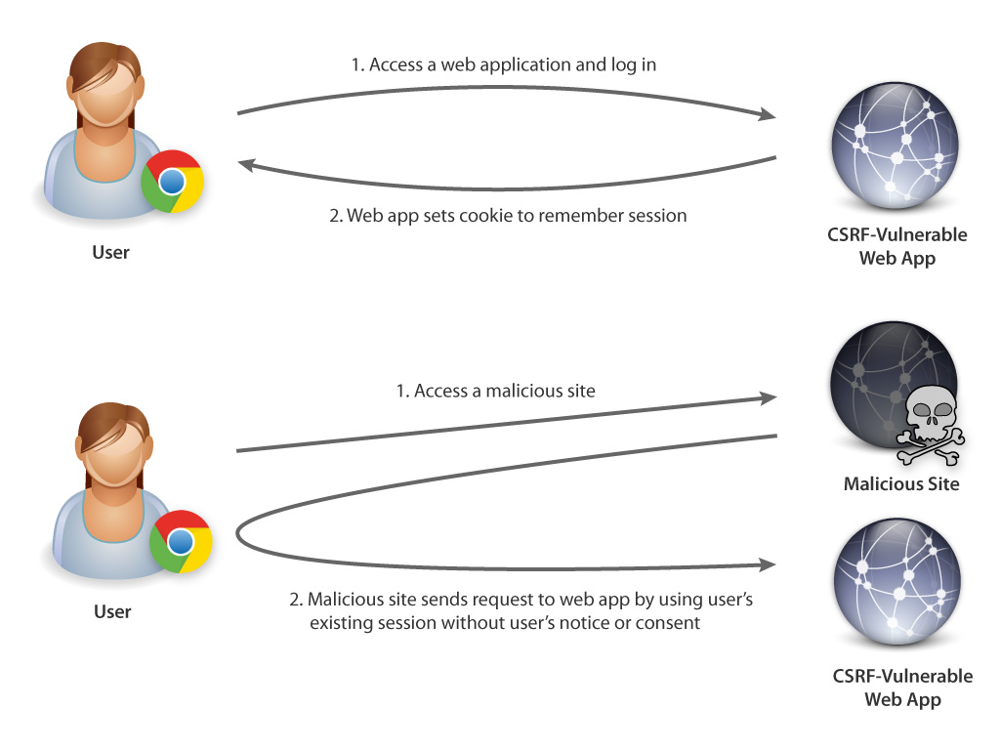
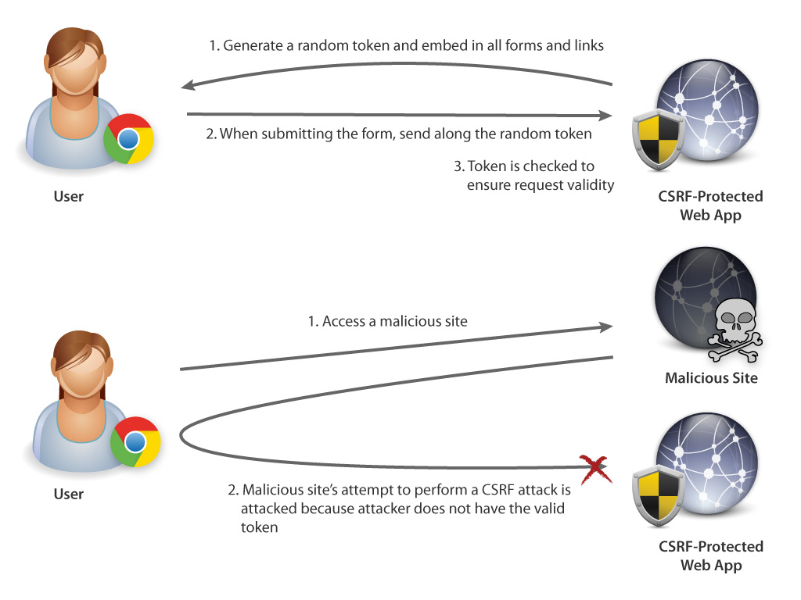
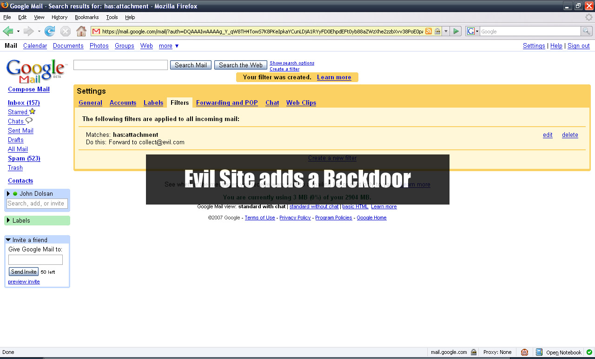

## Overview

This document covers the vulnerability known as **Cross-Site Request Forgery** or CSRF. Other names for this type of attack are **one-click attack** and **session riding**. The goal of the attack is to trick the victim into performing an action that will covertly run malicious code that performs unwanted actions on another website on which the victim holds an active user-session. Examples of attacks range from making malicious forum posts on a user’s personal blog or forum to causing the user to make unwanted online money transfers through their active online banking session.

## Prerequisites for a Successful Attack

To perform a successful attack a user must in some way initiate the attack, such as requesting a web page, clicking a link or hovering their mouse over an area, while having an active session open with the website that the attack is targeting. These attacks often target high traffic websites whose users tend to leave themselves logged in either indefinitely or for prolonged periods of time, since this user behaviour results in a much higher volume of successful attacks.

One other requirement of an attack to be successful is that the user must access the attacking code using the same browser which holds their active session with the target website. This is because the attack relies on the cookie the browser generates for an active user session with the target website, which holds the session data. This cookie is only accessible by the same browser that generated it so the attack must be initiated from the same browser to take advantage of the user session that the specific browser has made with the target website.

## How does the attack work?

Many web applications nowadays use cookies to store user sessions, so web applications can be used without users constantly having to log in. CSRF attack exploits this feature and uses active login sessions of victims to attack web applications. As Figure 1 shows, cookies created by web applications are often stored by browsers for a certain amount of time, which can range from hours to months. During the active session, if users visit any malicious site, the CSRF attack code would, without victims’ consent or notice, submit HTTP requests to target web applications and modify data stored. In essence, CSRF vulnerability allows attackers to create a malicious website that forges web requests to attack another website, hence the name—Cross Site Request Forgery.

 Figure 1: How CSRF Works

The CSRF attack can be categorized into the ones that send HTTP GET or POST requests. Details of these two types of CSRF attack are discussed below.

### GET Attack

HTTP GET attack is usually done by embedding a piece of code in HTML that triggers browsers to send HTTP GET requests to the target server. The most common way to achieve this is via the HTML `` tag, for example:

``` html

```

It is also common to launch this attack via HTML `<iframe>` tag, for example:

``` html
<iframe src="http://www.example.com/attacked-webapp/?action=delete&accountId=123"
  frameborder="0" style="width:0; height: 0;"></iframe>
```

Note that as demonstrated in both examples, attackers usually try to hide the attack code, so victims are usually not aware of the attack until damages have been done.

### POST Attack

Since web applications commonly expect HTTP requests that modify data to be sent via POST method, strategies have also been developed to launch CSRF attacks with POST requests. This type of attacks is usually more complex and requires the use of HTML ```<iframe>``` tag, for example:

``` html
<iframe src="attack.html" frameborder="0" style="width:0; height: 0;"></iframe>
```

Note that, unlike the attack using GET requests, the POST version uses iframe to load the html page crafted by the attacker, allowing the attacker to execute arbitrary JavaScript code. An example of such would look like:


``` html
<script type="text/javascript">
// <![CDATA[
window.onload = function() {
  var form = document.getElementById('form').submit();
  form.submit();
};
// ]]>
</script>
<form id="form" action="http://www.example.com/attacked-webapp/form" method="post">
  <input type="hidden" name="action" value="delete" />
  <input type="hidden" name="accountId" value="123" />
</form>
```

As the code illustrates, the HTML `<form>` allows the attacker to define the data to be sent to the target web application. The JavaScript code inside `<script>` in turn submits the form (via `form.submit();`) the page loads (via `event window.onload`). Victims that load this page via the `<iframe>` will immediately submit POST requests to the target web application.

### Crafting the Attack Request

Knowing how to craft a malicious code that performs CSRF attack is not enough; attackers must also know exactly how requests should be, in order to be accepted by the target web application as valid requests. CSRF attack is therefore usually performed on web applications that attackers have access to. Common examples include bank websites, webmail services and open source software. Once attackers gain the knowledge of how the target web application creates requests, attack code, as shown above, can then be written to emulate such requests.

### Discovering Websites with CSRF Vulnerability

After gaining access to a web application, hackers can easily analyze how web requests are formed by the application. The lack of CSRF protection of a web application is usually very evident, and attackers can quickly tell if a web application is vulnerable to CSRF attack by merely examining the application’s URL and HTML source code. No knowledge of the application’s backend code is required. Therefore, to perform CSRF attack on websites, an attacker can compile a list of targets and quickly scan each one to see which ones are vulnerable.

### Triggering the Attack

To launch CSRF attack, victims need to open webpages created by attackers, or, at the very least, visit a webpage with the malicious `` or `<iframe>` tag. The former can be done by social engineering, phishing, search engine poisoning, DNS poisoning and more. The latter can be done using XSS and infect popular websites with such vulnerability.

## Threats

As mentioned previously there are many kinds of attacks that can be performed with CSRF, ranging from minor annoyances to life altering events. As people’s real lives become more and more intertwined with their online presence and personas, CSRF attacks will pose much larger threats to their quality of living. Attackers targeting vulnerable websites that store user data such as email, banking info, billing info, or private photos can then use the vulnerability to make unwanted actions on these sites. These actions have a very real effect on people’s lives, since these websites act as a proxy for the person whom they belong to. Actions like sending threatening or nuisance emails to contacts, transferring money from one account into another, or purchasing items from e-commerce websites all impact the person whose account was manipulated into doing so.

## Protection against CSRF

While it is very easy to launch a CSRF attack, it is not difficult to defend against it, either. Many modern web frameworks, such as Django, now offer built-in defense against CSRF. This section discusses two main types of methods to protect a web application against CSRF and a few less significant ones.

### Token-Based

Token-based CSRF protection, in essence, adds a random token to a web form and verifies it after the web form is submitted. Since attackers do not have a way to determine the values of the tokens that users receive from the target, this protection gives web applications the ability to verify the authenticity of web requests received. As Figure 2 shows, attempts to launch a CSRF attack without a valid token by the malicious site would be blocked.

 Figure 2: How Token-Based Protection Works

To ensure the effectiveness of this protection, random tokens generated are unique among users and are stored on the server side for a limited amount of time. Tokens are also commonly invalidated and regenerated after a successful form submission to increase the randomness of tokens, therefore improving effectiveness of the protection. Requests with tokens absent or not found among user’s valid ones are rejected.

For GET requests, using this protection, web apps append tokens to the url. For example:

```
http://www.example.com/protected-webapp/?action=delete&accountId=123&token=202cb962ac59075b964b07152d234b70
```

As users access such link, tokens would be sent to the server.

For POST requests, tokens are placed inside a hidden input field. For example:

``` html
<form id="form" action="http://www.example.com/protected-webapp/form" method="post">
  ... other fields omitted for brevity ...
  <input type="hidden" name="token" value="202cb962ac59075b964b07152d234b70" />
</form>
```

Since adding such protection to all forms and links can be an overhead, modern web frameworks commonly make token-based CSRF protection easy to implement or implement it automatically without the need for developers to do anything. Security filters, such as [OWASP CSRFGuard](https://www.owasp.org/index.php/Category:OWASP_CSRFGuard_Project), can also be used to protect legacy web applications that are vulnerable to CSRF.

### Password Verfication

A second way to implement CSRF protection is to request user password to be reentered after a form is submitted. This protection, while less common and more difficult to implement, is equally effective against CSRF attacks and can also be used to ensure the authenticity of users that submit form requests. This protection, therefore, makes sense for web forms that can have significant consequences when misused. Password change and money transfer forms are examples that commonly request user password to be entered. [CVE-2010-4408](http://cve.mitre.org/cgi-bin/cvename.cgi?name=CVE-2010-4408) is another example of using password verification to protect the user account modification form by Apache Archiva.

### Other Protections

Aside from the two main types of CSRF protections, there are a few other types of protections.

- Browser extensions, such as [RequestPolicy](https://addons.mozilla.org/en-us/firefox/addon/requestpolicy/) or [CsFire](https://addons.mozilla.org/en-us/firefox/addon/csfire/), defer CSRF attacks by either preventing cross-site form submissions or removing session cookies from cross-site requests. Such extensions protect users from CSRF attacks to any websites but may interfere with normal functionality of a website.
- Checking the HTTP Referer header can also be a way to detect form submissions from a malicious site. However, some browsers or web proxies remove HTTP Referer header, thus making this strategy more difficult to work in reality.
- Limiting the lifetime of cookies for tracking login sessions is suggested on Wikipedia as a way to defer CSRF attack. This strategy, however, does not completely protect sites against CSRF, as such attacks still work during the limited login session. Users may also be forced to login more often, resulting in a poor user experience.
- Certain platforms or languages have various ways to implement CSRF protections. For example, platforms such as Silverlight and Flash have configuration files, such as crossdomain.xml, that restrict remote access.

## Dynamic CSRF Variant

While the CSRF examples discussed above are static, a dynamic variant exists. This type of CSRF attack tries to guess the random token by sending a large number of requests. As such, it is important to ensure the randomness of protection tokens and limit their lifetime, in order to defeat such an attack.

## Well Known Examples of this Attack

One example of this attack afflicted Google Mail in 2007 when an attacker used CSRF to gain access to Gmail users’ emails. The way this was accomplished was to run malicious code which would add a filter to users’ email accounts. This filter would redirect all email messages sent to the user, allowing the attacker to gain access to private emails on any “infected” account. What was even worse was the fact that even after the vulnerability that allowed this attack to succeed was patched, users were still affected until they manually removed the filter from their accounts.

 Figure 3: Gmail Under Attack

Another potential attack could be targeted at [www.INGDirect.com](http://www.ingdirect.com/) in 2008. The attacker would have been able to create additional accounts in a user’s name and then proceed to transfer money out of that user’s primary bank account into the additional account without their knowledge. ING had not protected their site against CSRF at the time, so the attack required nothing more than mimicking the steps a user would take to transfer funds.

Once again in 2008, a CSRF attack could be made against YouTube users which allowed the attacker to perform all the actions the user was able to perform. Among these, the attacker could add videos the the victim’s Favorites list, add himself/herself as a friend of the victim and send messages on behalf of the victim.

One last example of the CSRF attack was seen happening on Twitter in 2009, when an attacker was able to change the statuses of Twitter users to an embarrassing text message if they visited a compromised website by clicking a shortened link posted on Twitter.

## Conclusion

As this report illustrates, CSRF is a dangerous vulnerability, as such attacks can be easily created and can result in serious damages. Fortunately, CSRF vulnerability is not difficult to counter, as many web frameworks now have built-in defense against it, and security filters are also available for defending existing web applications. It is therefore important for developers and system administrators to learn about CSRF and take the time to ensure the security of web applications.

## Links

- [Cross-Site Request Forgery on OWASP.org](https://www.owasp.org/index.php/Cross-Site_Request_Forgery_%28CSRF%29)
- [Cross-Site Request Forgery on Wikipedia](http://en.wikipedia.org/wiki/Cross-site_request_forgery)
- [Protection Against CSRF Part 1 (YouTube)](http://www.youtube.com/watch?v=1Zl1knffy-Y)
- [Protection Against CSRF Part 2 (YouTube)](http://www.youtube.com/watch?v=AFvwMH27xCw)
- [CSRF Attack (YouTube)](http://www.youtube.com/watch?v=QJmYhIJraOo)
- [Django’s CSRF Protection](https://docs.djangoproject.com/en/1.4/ref/contrib/csrf/)
- [CVE-2010-4408](http://cve.mitre.org/cgi-bin/cvename.cgi?name=CVE-2010-4408)
- [Google Gmail E-mail Hijack Technique](http://www.gnucitizen.org/blog/google-gmail-e-mail-hijack-technique/)
- [CSRF Worm Released on Twitter](http://news.softpedia.com/news/CSRF-Worm-Released-on-Twitter-158085.shtml)

